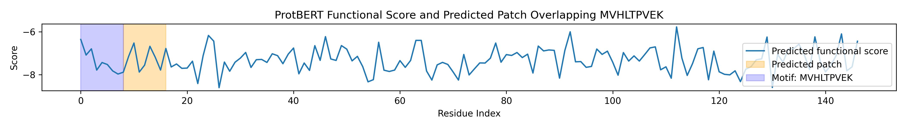

# Candidate Allosteric Patch: KSAVTALWG

The sequence **KSAVTALWG** has emerged as a likely candidate for an allosteric patch relevant to hemoglobin S (HbS) polymerization. This segment is notable for its unique combination of side chains, which may enable both specific binding and allosteric modulation of the sickling interface.

## 1. Sequence Features and Structural Context

```
K  S  A  V  T  A  L  W  G
Lys Ser Ala Val Thr Ala Leu Trp Gly
```

- **Lysine (K):** Positively charged, can form salt bridges or hydrogen bonds, potentially anchoring the patch to acidic or polar regions.
- **Serine (S), Threonine (T):** Polar, capable of hydrogen bonding, may contribute to specificity and orientation.
- **Valine (V), Leucine (L), Alanine (A):** Hydrophobic, likely to interact with nonpolar surfaces, possibly mimicking or blocking the hydrophobic contacts critical for HbS polymerization.
- **Tryptophan (W):** Bulky aromatic, can participate in π-stacking or hydrophobic interactions, possibly capping or distorting the polymerization interface.
- **Glycine (G):** Provides flexibility, may allow the patch to adapt to the local protein surface.

## 2. Allosteric Mechanism Hypothesis

This patch could function by binding to a surface-exposed region of the β-globin chain, either at or near the sickling interface. By engaging in a combination of hydrophobic, polar, and electrostatic interactions, KSAVTALWG may:

- Sterically hinder the approach of another hemoglobin tetramer, blocking polymer growth.
- Induce a local conformational change that destabilizes the polymerization-prone T-state.
- Serve as a scaffold for further chemical modification or ligand attachment, enhancing selectivity or potency.

## 3. Design and Therapeutic Implications

- **Peptidomimetic Design:** The sequence can be used as a template for designing stable peptidomimetics or macrocycles that retain the key side-chain functionalities.
- **Small Molecule Mimetics:** Key interaction motifs (e.g., K, T, W) can be mimicked by small molecules for improved drug-like properties.
- **Allosteric Modulation:** Targeting this patch may allow for allosteric inhibition of HbS polymerization without interfering with oxygen binding or normal hemoglobin function.

## 4. Structural Visualization

Below is a structural representation of the candidate allosteric patch:

